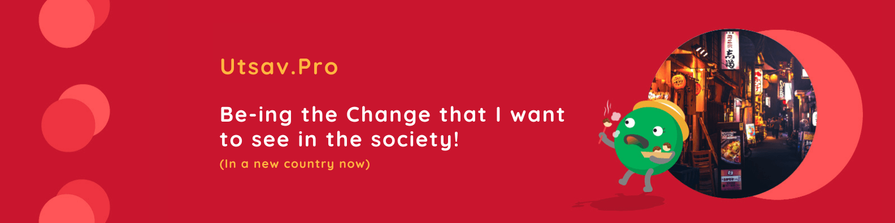
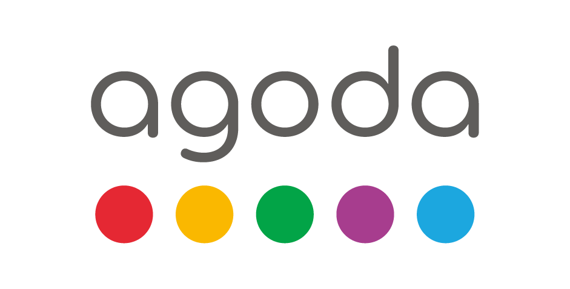

  

## 👋 Hello
I’m Utsav Barnwal a **passionate & professional Full-stack Developer**. In my working experience of ~6 years, I have worked with several clients and have architected & built 40+ scalable [projects](https://isolpro.in/portfolio) and published 20+ [open-source libraries](https://github.com/utsavdotpro?tab=repositories). I love to learn and teach technical stuff.  

Want to know more about me? Checkout my links: https://bento.me/utsavdotpro

- 👀 &nbsp; I’m interested in **learning technical stuffs** and **building real-world applications**
- 🎸 &nbsp; I’m currently learning to play Ukulele
- 💞️ &nbsp; I’m looking to collaborate on some awesome **JS** or **Android libraries**
- 📫 &nbsp; Reach me at me@utsav.pro
- 📆 &nbsp; Schedule a call: https://topmate.io/utsavdotpro

## 💼 Work (Recent)

    

  I am currently employed with [**Agoda**](https://agoda.com/), one of the top travel companies in Asia, as a full-stack developer with prime focus on back-end.

  

---

    

  In my free time, I take orders from my startup [IsolPro](https://isolpro.in) and build projects for clients from across India (and a few from abroad). This allows to be understand solve real-world problems.

---

    
  
  As a contractor from [Proximity Works](https://www.proximity.tech), I have worked with **[Hotstar](https://hotstar.com)**, an Indian brand of subscription video-on-demand over-the-top streaming service operated by Disney Media, a division of The Walt Disney Company.

  

---

    

  As a consultant with **[Inkredo](https://inkredo.in/)**, I led a small team of developers to build a CRM for lenders to better manage their customers & improvise collections.

  

🔗 See my full work history on [ LinkedIn](https://www.linkedin.com/in/utsavdotpro/)

## 📈 Stats

## ⚡ Technologies

| | | |
| - | - | - |
| **One True-love:** |  |
| |
| **Go-to Stack** | |
| Front-end: |  |
| Back-end: |  | Swagger |
| Mobile: |  | ReactNative, Expo, RealmDB |
| Tools: |  | Postman |
| Others: |  | Yarn, JWT |
| |
| **Know & Use** (in no specific order)**:** |  | Websocket, DigitalOcean |
| |
| **Used in Previous Life:** |  |
